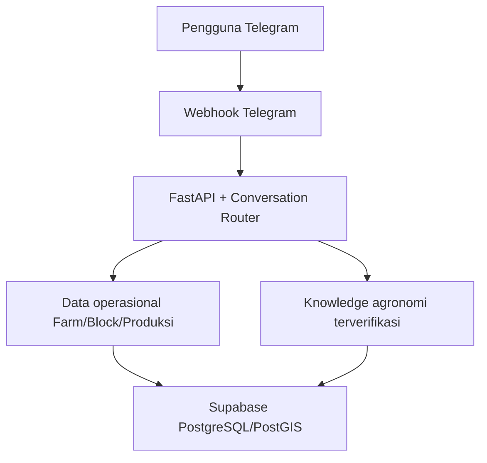

# PalmAgronomy AI Agent — Project Context

**Status diperbarui:** 18 Agustus 2026  
**Versi aplikasi:** `0.9.0`  
**Repository:** `https://github.com/aprizal543/palm-agronomy`  
**Branch utama:** `main`

## 1. Fungsi Dokumen

Dokumen ini adalah konteks teknis utama untuk melanjutkan PalmAgronomy AI Agent pada percakapan, perangkat, atau kontributor baru. Gunakan repository, migration, test, dan dokumen ini sebagai sumber kebenaran. Jangan menggunakan transkrip chat lama sebagai spesifikasi utama karena dapat memuat eksperimen atau keputusan yang sudah tidak berlaku.

Urutan sumber kebenaran:

1. kode dan migration pada branch `main`;
2. automated tests;
3. dokumen pada folder `docs/`;
4. percakapan ChatGPT.

## 2. Tujuan Produk

PalmAgronomy adalah AI Agent agronomi kelapa sawit berbasis percakapan yang membantu pengguna:

- menentukan konteks kebun dan blok secara spasial;
- mencatat produksi dengan konfirmasi manusia;
- membaca riwayat dan ringkasan produksi;
- menjawab pertanyaan agronomi dari sumber terverifikasi;
- memberikan analisis operasional berdasarkan data aktual Farm/Block;
- beroperasi melalui Telegram sebagai antarmuka pertama.

Produk ini adalah sistem **software-first**, bukan proyek IoT. Core concept tidak boleh diperluas menjadi IoT, SaaS generik, atau chatbot bebas tanpa keputusan baru yang eksplisit.

## 3. Arsitektur Saat Ini

| Lapisan | Implementasi |
|---|---|
| Antarmuka | Telegram Bot |
| API | FastAPI |
| Runtime | Python, Uvicorn |
| Data access | SQLAlchemy async + `asyncpg` |
| Database | Supabase PostgreSQL + PostGIS |
| Migration | Alembic |
| Spatial backbone | Farm, Block, polygon, point lookup, validasi spasial |
| Knowledge | Verified agronomy RAG dengan provenance dan audit |
| Deployment | Railway dari GitHub branch `main` |
| Telegram production | Webhook HTTPS |
| Telegram local | Long polling, hanya untuk development |

Alur utama:



## 4. Domain dan Data Utama

Entitas utama yang sudah digunakan mencakup:

- user dan profil Telegram;
- farm/kebun;
- block/blok spasial;
- farm membership dan access role;
- conversation dan konteks aktif;
- pending action untuk konfirmasi tindakan;
- production record;
- knowledge source dan knowledge chunk;
- audit log agent dan query RAG.

Nama tabel/kolom final harus selalu dikonfirmasi melalui migration terbaru, bukan disimpulkan hanya dari dokumen ini.

## 5. Kemampuan yang Sudah Berjalan

### Spatial context

- Farm dan Block tersimpan di PostgreSQL/PostGIS.
- Blok memiliki geometri dan validasi spasial.
- Konteks pengguna memuat kebun, blok, luas, dan hak akses.
- Perintah `/context` menampilkan konteks aktif.

### Pencatatan produksi

- Pengguna dapat membuat draft produksi.
- Penyimpanan membutuhkan tombol konfirmasi **Simpan**.
- Pembatalan tidak membuat production record.
- Riwayat dan ringkasan membaca data yang sudah dikonfirmasi.

### Verified agronomy RAG

- Retrieval hanya menggunakan source berstatus `verified`.
- Jawaban tanpa evidence yang cukup tidak boleh mengarang.
- Provenance dan status verifikasi tetap disimpan di database.
- Pesan Telegram hanya menampilkan identitas sumber yang ringkas; URL langsung dan preview PDF disembunyikan dari jawaban pengguna.

### Contextual production analysis

Pertanyaan yang berhasil dikenali dapat menghasilkan:

- produksi terakhir;
- jumlah tandan;
- luas blok;
- estimasi hasil kg/ha;
- tanggal pencatatan;
- catatan kecukupan data untuk analisis tren.

### Deployment

- API versi `0.9.0` aktif di Railway.
- Healthcheck `live` dan `ready` berhasil.
- Telegram sudah merespons melalui deployment cloud.
- Deployment terhubung ke GitHub dan branch `main`.

## 6. Batasan yang Diketahui

Pemahaman bahasa saat ini masih mengandalkan conversation router berbasis pola/intent deterministik. Contoh:

- “Bagaimana kondisi produksi blok saya?” dikenali sebagai analisis produksi.
- “Bagaimana produksi kebun blok saya?” dapat masuk fallback meskipun maksudnya serupa.

Ini bukan masalah Railway, webhook, atau database. Ini adalah keterbatasan natural-language understanding pada router saat ini.

Perbaikan berikutnya harus menggunakan pendekatan hybrid:

1. normalisasi teks dan synonym mapping;
2. deterministic routing untuk intent berisiko dan operasi database;
3. semantic/LLM intent classification sebagai fallback;
4. confidence threshold dan clarification;
5. authorization serta human confirmation tetap wajib.

LLM tidak boleh langsung melakukan write, menentukan Farm/Block tanpa validasi, atau membuat rekomendasi agronomi tanpa evidence.

## 7. Lingkungan Development

Lokasi repository pengguna:

```text
D:\palm-agronomy
```

Virtual environment:

```powershell
.\palm_agronomy\Scripts\Activate.ps1
```

Perintah pemeriksaan utama:

```powershell
python scripts\verify_source.py
python -m pytest
python -m alembic current
python -m alembic upgrade head
```

Menjalankan API lokal:

```powershell
python -m uvicorn app.main:app --reload
```

Menjalankan Telegram polling lokal:

```powershell
python -m scripts.run_telegram_polling
```

**Penting:** polling lokal dan webhook production tidak boleh digunakan bersamaan. Polling lokal dapat menghapus atau mengganggu webhook Telegram.

## 8. Environment Variable

Rahasia hanya disimpan pada `.env` lokal atau Railway Variables. Jangan menulis nilainya di dokumentasi, screenshot publik, commit, atau chat.

Kelompok konfigurasi yang digunakan:

- aplikasi: `APP_ENV`, `APP_NAME`, `API_V1_PREFIX`;
- database: `DATABASE_URL`, `MIGRATION_DATABASE_URL`, pool settings;
- observability: `LOG_LEVEL`, `JSON_LOGS`, readiness timeout;
- Telegram: `TELEGRAM_ENABLED`, `TELEGRAM_MODE`, `TELEGRAM_BOT_TOKEN`, `TELEGRAM_WEBHOOK_SECRET`, webhook settings;
- agent: `AGENT_PROVIDER`.

Gunakan `.env.example` sebagai daftar canonical variable tanpa nilai rahasia.

## 9. Prompt untuk Chat Baru

Gunakan prompt berikut setelah melampirkan dokumen handoff ke chat baru di Project Rizal:

```text
Pelajari PROJECT_CONTEXT.md, ROADMAP.md, DECISIONS.md, dan
SPRINT_8_HANDOFF.md sebagai sumber kebenaran proyek PalmAgronomy.

Jangan mengulang sprint yang sudah selesai dan jangan mengubah core concept
tanpa alasan teknis yang kuat. Kode, migration, tests, dan dokumentasi repository
lebih tinggi prioritasnya daripada asumsi percakapan.

Sebelum mengusulkan perubahan:
1. ringkas status proyek yang Anda pahami;
2. pisahkan fakta terverifikasi dari asumsi;
3. identifikasi pekerjaan yang benar-benar belum selesai;
4. susun rencana Sprint 9 beserta acceptance criteria dan test plan;
5. jangan meminta atau menampilkan nilai rahasia dari .env.
```
